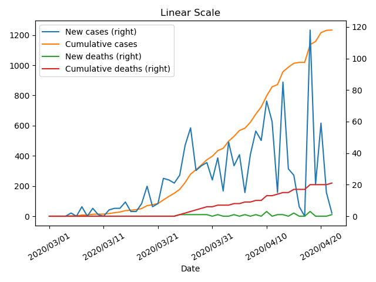

# covid-19-san-francisco

Daily updates on the number of new cases and total cases in San Francisco

Updates are sourced from the [San Francisco Department of Public Health website](https://www.sfdph.org/dph/alerts/coronavirus.asp).

Updates for a given date cover the 24 hour period from 9am of that date to 9am of the previous day.

Historical data from 03/1 - 03/29 from https://github.com/ptraughber/covid-19-san-francisco

To update figure and CSV, run `./update-covid-19.py`

